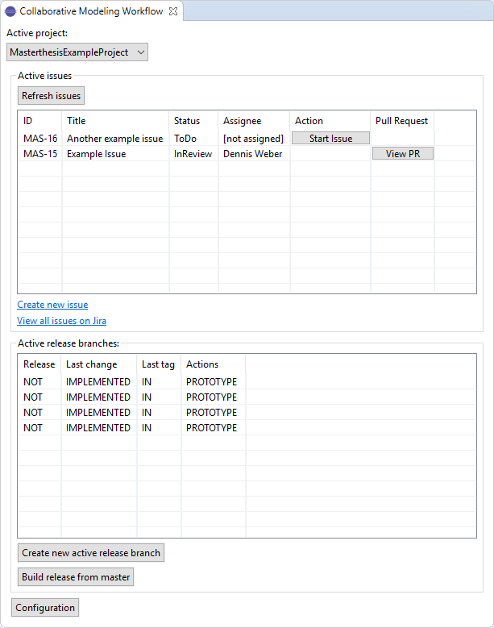
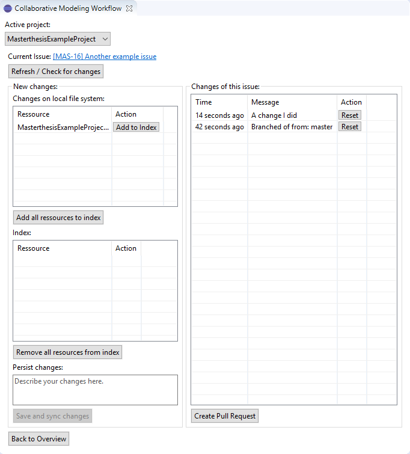
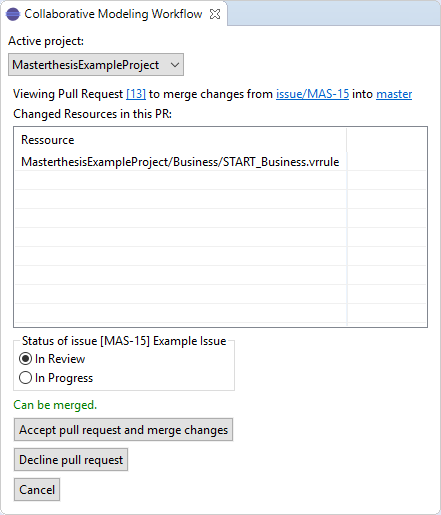

# modelingWorkflowEclipsePlugin
A prototype application to to support the modeling workflow described in Dennis Weber's [masters thesis](http://masterthesis.dennis-weber.info).

This prototype is a Eclipse plugin, capable of reading issues from a Jira system, creating and updating git branches (according to the modeling workflow) and communicating with a Bitbucket server to manage Pull Requests.

